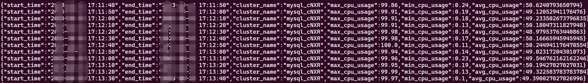

# 基于PyFlink 1.16.x 版本的实践代码
## 文档
### 基础
- [一文搞明白pyflink作业提交](https://mp.weixin.qq.com/s?__biz=MzU3Njc2MjAyNg==&mid=2247486860&idx=1&sn=8c1135173ea314a7c4adfa32636a395d&chksm=fd0fb449ca783d5fd1b606e5384f70edb1f7c885066af75e5029d8c5be89c7832381bae89fc6&scene=178&cur_album_id=1690280491406376964#rd "一文搞明白pyflink作业提交")
- [PyFlink CDC入门篇](https://mp.weixin.qq.com/s?__biz=MzU3Njc2MjAyNg==&mid=2247486985&idx=1&sn=5e7b39d4df1573243e1a7332da964eff&chksm=fd0fb7ccca783eda8b23ca722456485639dc8b344a14968ca113c53937b44d1257d3dc207f7b&scene=178&cur_album_id=1690280491406376964#rd "PyFlink CDC入门篇")
- [Flink窗口实践(一)](https://mp.weixin.qq.com/s?__biz=MzU3Njc2MjAyNg==&mid=2247487023&idx=1&sn=14b9d62d4c89433e27134371c82f1718&chksm=fd0fb7eaca783efcdce6008a80d348fa969dfec1735d932e44d574a7af0d78a37ee029a52494&scene=178&cur_album_id=1690280491406376964#rd "Flink窗口实践(一)")

## 示例代码
### 窗口
**生成数据**
```shell
python cpu_usage.py
```
**滚动窗口**
```shell
flink run \
-py tumbling_example1.py \
-p 1 \
-pyexec ~/venv/flink/bin/python3 \
-pyclientexec ~/venv/flink/bin/python3
```

输出结果如：



**滑动窗口**
```shell
flink run \
-py sliding_example1.py \
-p 1 \
-pyexec ~/venv/flink/bin/python3 \
-pyclientexec ~/venv/flink/bin/python3
```

输出结果如：


**会话窗口**
```shell
flink run \
-py session_example1.py \
-p 1 \
-pyexec ~/venv/flink/bin/python3 \
-pyclientexec ~/venv/flink/bin/python3
```

---
# 关于我
#### 公众号: 子睿闲谈

